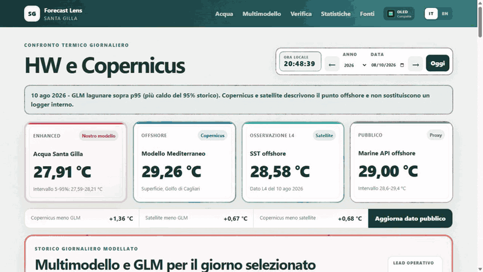

# Santa Gilla Forecast Lens

Tool pubblico read-only per confrontare la baseline GLM 01, le traiettorie operative direct e recursive del notebook 03, il modello Copernicus Marine sul punto offshore nel Golfo di Cagliari, la SST satellitare Copernicus L4 NRT, proxy marini, forcing meteorologico pubblico e la verifica omogenea delle previsioni meteorologiche.

Il selettore anno espone la ricostruzione giornaliera ufficiale 1995-2024: 10.958 giorni con temperatura d'acqua ricostruita, climatologia 1982-2011, p90, p95, anomalia e classificazione heatwave-like. Il successivo archivio 2025-2026 resta dedicato al confronto fra riferimento modellato, previsione originale e previsione corretta.

Il panorama termico in fondo riunisce i valori disponibili dal 1995 al giorno corrente. Tutti i dati giornalieri alimentano un inviluppo min-max per colonna, mentre le medie mensili rendono leggibile l'andamento di lungo periodo anche su schermi mobili.

## Tutorial rapido

[Apri la versione MP4](tutorial.mp4)

## Confine scientifico

La temperatura lagunare e la temperatura marina offshore non rappresentano lo stesso target. Il confronto misura un contrasto spaziale e non costituisce una validazione diretta del modello lagunare.

Il repository non contiene notebook, Excel scientifici, osservazioni riga-per-riga, coefficienti, dati di training o file del modello addestrato.

Le curve operative multimodello sono indicate come replay locale a risorse limitate. Le metriche aggregate direct, observed-day e recursive provengono invece dal full run ufficiale del notebook 03. I protocolli sono distinti e non costituiscono una classifica unica.

La finestra operativa viene rigenerata ogni giorno: due giorni recenti, il giorno di emissione e quattordici giorni futuri. Ogni emissione conserva soltanto le proprie previsioni pubblicabili per consentire confronti successivi senza distribuire la temperatura d'acqua osservata privata.

## Stato

Prototipo scientifico operativo. Non adatto alla navigazione, ad allerta sanitaria o a decisioni regolatorie.
